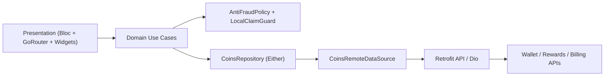

# Coins System Module

Standalone Flutter package for a production-grade coins economy. It is intentionally isolated in `modules/coins_system` so you can review and integrate it later without touching the current app flow.

## What this package covers

- Wallet balance with available, reserved, earned, and spent totals
- Full transaction history with pagination
- Task reward claim validation
- Rewarded ad completion validation
- Coin package purchase verification
- Premium feature spending with insufficient balance protection
- Duplicate reward prevention through idempotency and local replay guards
- Anti-fraud policy hooks for high-risk claims
- Premium wallet UI with `flutter_bloc` and `go_router`
- Clean architecture with `get_it`, `injectable`, `dio`, `retrofit`, `freezed`, and `json_serializable`
- Extensible transaction types for daily rewards, referrals, promo codes, and bonuses

## Architecture



### Design notes

- `WalletOverview` is the read model for the wallet screen.
- `LedgerMutationResult` is the write model for task rewards, ads, purchases, and spending.
- Idempotency keys are derived from immutable business references such as `completionId`, `networkTransactionId`, and `transactionId`.
- Local replay protection prevents duplicate taps in the client. The backend contract is still the source of truth.

## Folder structure

```text
modules/coins_system/
  lib/
    coins_system.dart
    src/
      core/
        error/
        security/
        usecase/
      data/
        models/
        remote/
        repositories/
      di/
      domain/
        entities/
        repositories/
        usecases/
      presentation/
        bloc/
        pages/
        router/
        widgets/
  test/
    domain/
```

## Domain models

| Model | Purpose |
| --- | --- |
| `WalletBalance` | Available, reserved, lifetime earned, lifetime spent, last update. |
| `WalletOverview` | Balance plus packages, premium features, recent transactions, and risk flags. |
| `CoinTransaction` | Canonical ledger entry for rewards, purchases, spending, reversals, and bonuses. |
| `CoinPackage` | Buyable package SKU with coins, bonus coins, and localized pricing data. |
| `PremiumFeature` | Coin-spendable feature with feature id, title, category, and cost. |
| `TaskRewardClaim` | Reward claim payload for completed app services/tasks. |
| `RewardedAdClaim` | Reward claim payload for rewarded ads with SSV proof fields. |
| `PurchaseVerificationRequest` | Purchase verification payload for store receipts and signatures. |
| `SpendCoinsCommand` | Premium spend request with idempotency key and business reference. |
| `LedgerMutationResult` | Result of any ledger mutation plus updated balance and review status. |

## Use cases

| Use case | Responsibility |
| --- | --- |
| `GetWalletOverviewUseCase` | Loads wallet summary, coin packages, premium features, and recent activity. |
| `GetTransactionHistoryUseCase` | Loads paginated ledger history. |
| `ClaimTaskRewardUseCase` | Validates task reward payload, blocks duplicates, then calls backend claim API. |
| `ClaimRewardedAdUseCase` | Validates ad completion payload, SSV token presence, freshness, and duplicate guard. |
| `VerifyCoinPurchaseUseCase` | Validates purchase payload then submits receipt verification to backend. |
| `SpendCoinsUseCase` | Validates spend request, checks local balance snapshot, then executes spend mutation. |

## API contracts

### 1. Get wallet overview

- `GET /v1/coins/wallets/{userId}`
- Response: `WalletOverviewDto`

### 2. Get transaction history

- `GET /v1/coins/wallets/{userId}/transactions?cursor={cursor}&limit={limit}`
- Response: `TransactionPageDto`

### 3. Claim task reward

- `POST /v1/coins/rewards/tasks/claim`
- Header: `X-Idempotency-Key`
- Body: `TaskRewardClaimRequestDto`
- Response: `LedgerMutationResultDto`

### 4. Claim rewarded ad reward

- `POST /v1/coins/rewards/ads/claim`
- Header: `X-Idempotency-Key`
- Body: `RewardedAdClaimRequestDto`
- Response: `LedgerMutationResultDto`

### 5. Verify coin package purchase

- `POST /v1/coins/purchases/verify`
- Header: `X-Idempotency-Key`
- Body: `PurchaseVerificationRequestDto`
- Response: `LedgerMutationResultDto`

### 6. Spend coins on premium features

- `POST /v1/coins/spend`
- Header: `X-Idempotency-Key`
- Body: `SpendCoinsRequestDto`
- Response: `LedgerMutationResultDto`

### Suggested backend guarantees

- Server-side idempotency on every reward, purchase, and spend mutation
- Signed task completion proof or trusted backend task-state lookup
- Rewarded ad server-side verification token validation
- Store receipt verification with Google Play / App Store server APIs
- Immutable wallet ledger with reversal entries instead of destructive updates

## Validation logic

### Task rewards

- `taskId`, `completionId`, `serverProof`, and `deviceAttestationToken` are required
- reward amount must be positive and under configured max
- completion timestamp must be within freshness window
- duplicate completion ids are blocked locally and expected to be blocked by backend idempotency

### Rewarded ads

- `networkTransactionId`, `rewardNonce`, `serverSideVerificationToken`, and `deviceAttestationToken` are required
- watched duration must meet minimum completion threshold
- claim timestamp must be fresh
- ad reward amount must stay below policy max

### Purchases

- `transactionId`, `purchaseToken`, `signedPayload`, `productId`, and `packageSku` are required
- transaction timestamp must be fresh enough for store verification
- package SKU and expected product id must match server catalog
- duplicated transaction ids are rejected

### Spending

- spend amount must be positive
- `featureId` and `referenceId` are required
- local balance snapshot must be enough before calling backend
- backend remains the source of truth for final balance checks and reversals

## Anti-abuse rules

- Enforce `X-Idempotency-Key` on every wallet mutation request
- Maintain local replay guard to block duplicate taps and repeated submissions in one session
- Reject stale timestamps beyond allowed clock skew / freshness window
- Require device attestation token fields so you can plug in Play Integrity / App Attest later
- Require backend-issued proof for task completion and ad rewards
- Hold suspicious mutations in `pending_review` instead of crediting instantly when policy flags trigger
- Velocity limit high-frequency claims per account, device, IP, and ad unit on the backend
- Persist ledger as append-only; resolve disputes with reversal entries
- Audit metadata per transaction: source, task/ad/store reference, device fingerprint hash, app version, and locale

## UI components

- `CoinsWalletPage`: premium wallet shell with overview, store, and history tabs
- `PremiumWalletHeader`: hero balance card with action buttons and risk badges
- `CoinPackageGrid`: purchasable package tiles with bonus tags
- `PremiumFeatureList`: premium feature spend list with coin cost CTA
- `TransactionHistoryList`: paginated ledger history with status chips

## Future support

The model layer already reserves transaction types for:

- Daily rewards
- Referrals
- Promo codes
- Campaign bonuses
- Manual ops adjustments

## Implementation steps

1. Add backend endpoints with idempotency and immutable ledger writes.
2. Wire authenticated `CoinsConfig` values and platform-specific purchase/ad SDK bridges.
3. Call `ClaimTaskRewardUseCase` only after backend confirms task completion.
4. Call `ClaimRewardedAdUseCase` only after rewarded ad SDK emits completion plus SSV payload.
5. Call `VerifyCoinPurchaseUseCase` after store purchase callback succeeds.
6. Use `SpendCoinsUseCase` before unlocking premium features.
7. Add persistence or secure storage to `LocalClaimGuard` if you want replay protection across app restarts.
8. Add backend velocity limits, risk scoring, and transaction monitoring dashboards.

## Acceptance criteria

- Wallet screen shows accurate available balance, reserved balance, and recent transactions.
- Transaction history paginates without losing cursor state.
- Duplicate task completions do not credit twice.
- Duplicate rewarded ad callbacks do not credit twice.
- Purchase verification does not credit without valid receipt data.
- Spending fails gracefully with `InsufficientBalanceFailure` when balance is too low.
- Every repository method returns `Either<Failure, T>`.
- UI reacts to loading, empty, success, and failure states.
- Module compiles and tests pass independently from the main app.

## Integration note

This package is intentionally not imported by the main application yet. Treat it as a ready-to-wire module for a later integration pass.
